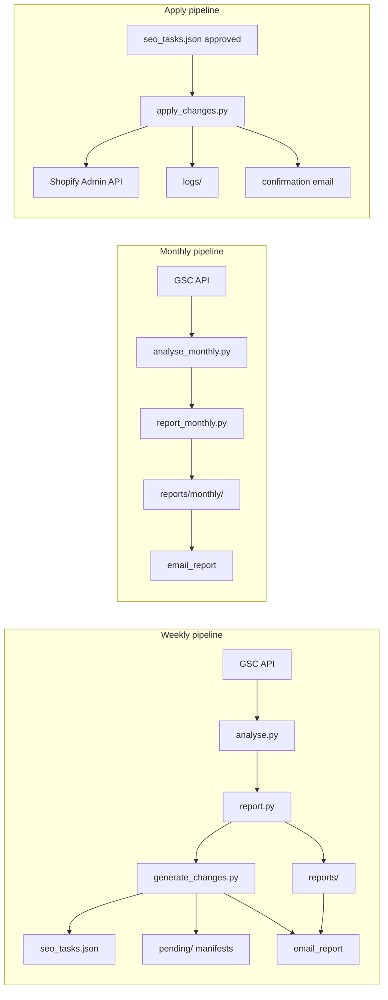

# Āhuru SEO Automation

Automated SEO monitoring, reporting, and Shopify meta updates for [ahurucandles.co.nz](https://ahurucandles.co.nz).

The stack pulls **Google Search Console** data, summarises it in Python, asks **Claude** to draft weekly and monthly Markdown reports, optionally **emails** stakeholders via Resend, and maintains a **task registry** (`seo_tasks.json`) that can push approved **meta updates** to Shopify.

**Two ways to work with data:**

1. **Interactive analysis:** [mcp-gsc](https://github.com/AminForou/mcp-gsc) in Cursor or Claude Desktop for ad-hoc GSC questions.
2. **Automated pipelines:** GitHub Actions (and matching local scripts) for weekly reports, monthly strategic reports, and manual apply runs.



---

## Automated pipelines

| Pipeline | When | Run locally | Workflow | Typical git changes |
|----------|------|-------------|----------|---------------------|
| **Weekly report** | Every **Monday 08:00** `Pacific/Auckland`; manual | `python src/run_weekly.py` | [`weekly_report.yml`](.github/workflows/weekly_report.yml) | [`reports/`](reports/) (including `latest.md`), [`seo_tasks.json`](seo_tasks.json) |
| **Monthly report** | First **Monday 08:00** `Pacific/Auckland` each month (cron `0 8 1-7 * 1` with that timezone); manual | `python src/run_monthly.py` | [`monthly_report.yml`](.github/workflows/monthly_report.yml) | [`reports/monthly/`](reports/monthly/) |
| **Apply SEO to Shopify** | Manual only | `python src/apply_changes.py` (see flags below) | [`apply_changes.yml`](.github/workflows/apply_changes.yml) | [`seo_tasks.json`](seo_tasks.json), [`logs/`](logs/) |
| **GitHub Pages (dashboard + reports)** | On push to `main`; manual | Open locally: [`dashboard.html`](dashboard.html) | [`github-pages.yml`](.github/workflows/github-pages.yml) | None (static deploy; bundles [`reports/`](reports/) and [`reports/monthly/`](reports/monthly) Markdown into the site) |

Scheduled workflows use **`timezone: Pacific/Auckland`**, so **08:00** is always Monday morning local time in New Zealand, including daylight saving changes (see [GitHub schedule syntax](https://docs.github.com/en/actions/writing-workflows/workflow-syntax-for-github-actions#onschedule)).

### Weekly run details

Steps: fetch GSC → [`analyse.py`](src/analyse.py) → [`report.py`](src/report.py) → save under [`reports/`](reports/) → [`generate_changes.py`](src/generate_changes.py) merges new tasks into [`seo_tasks.json`](seo_tasks.json) and writes a dated manifest under [`pending/`](pending/) → optional Resend: **report email** (highlights + link to the dashboard; see [`src/email_report.py`](src/email_report.py)), then **approval summary** when new tasks exist.

Raw GSC JSON for debugging is written to [`data/`](data/) (gitignored).

### Monthly run details

Steps: [`gsc_fetch_monthly.py`](src/gsc_fetch_monthly.py) (28d MoM + 90d YoY windows) → [`analyse_monthly.py`](src/analyse_monthly.py) → [`report_monthly.py`](src/report_monthly.py) → [`reports/monthly/`](reports/monthly/) → optional Resend **highlights** email (same pattern as weekly; full Markdown on the dashboard under **Monthly**).

On GitHub **schedule** only, [`run_monthly.py`](src/run_monthly.py) exits immediately unless that run falls on the **first Monday** of the month in `Pacific/Auckland`, so stray cron matches in the first week of the month do not publish duplicate reports. **workflow_dispatch** and local runs are not affected.

System prompts live in [`prompts/system_prompt.md`](prompts/system_prompt.md) (weekly) and [`prompts/system_prompt_monthly.md`](prompts/system_prompt_monthly.md) (monthly).

### `pending/` versus `seo_tasks.json`

The full backlog and task statuses live in **`seo_tasks.json`** at the repo root; that file is what Actions commits.

Dated manifests `pending/YYYY-MM-DD-changes.json` list tasks produced in that run. Root [`.gitignore`](.gitignore) ignores `*.json` except where explicitly negated, so **manifest JSON files are not tracked**; only [`pending/README.md`](pending/README.md) (and `.gitkeep`) are in git. Manifests still matter for local review and for the weekly approval email content.

### Approval dashboard (GitHub Pages)

[`dashboard.html`](dashboard.html) is the browser UI for reviewing `seo_tasks.json` and reading **weekly and monthly** Markdown reports (tab **SEO reports**). After the [`github-pages.yml`](.github/workflows/github-pages.yml) workflow has run, the live URLs are:

- `https://reonzpika.github.io/ahuru/` (same page as `index.html`)
- `https://reonzpika.github.io/ahuru/dashboard.html`

Each deploy copies **`reports/latest.md`**, dated weekly files matching `YYYY-MM-DD.md`, and **`reports/archive-index.json`** into **`/reports/`**, and copies **`reports/monthly/`** (including `latest.md`, `YYYY-MM.md`, and **`archive-index.json`**) into **`/reports/monthly/`**. On the dashboard, open **SEO reports**, choose **Weekly** or **Monthly**, then pick an archive or **Latest**.

Resend emails for weekly and monthly runs send **highlights only** (first sections of the Markdown plus the KPI strip), with links to the full report on the dashboard. The full file is never attached to the email.

**Privacy:** on a **public** GitHub Pages site, anything under **`/reports/`** and **`/reports/monthly/`** is **world-readable**. Approving tasks and dispatching Actions still uses a **Personal Access Token** in the browser (see dashboard copy); that token is not used to load the published report files.

**One-time setup (repository admin):** **Settings → Pages → Build and deployment → Source:** choose **GitHub Actions** (not “Deploy from a branch”). The first push to `main` after that (or **Actions → Deploy GitHub Pages → Run workflow**) publishes the site. Pushing the weekly report to `main` triggers a new Pages deploy, so `/reports/latest.md` tracks the repo after the workflow finishes. See [GitHub Pages documentation](https://docs.github.com/en/pages).

---

## GitHub Actions secrets

Add these under **Settings → Secrets and variables → Actions** (repository secrets).

| Secret | Weekly | Monthly | Apply |
|--------|:------:|:-------:|:-----:|
| `GOOGLE_SERVICE_ACCOUNT_JSON` | Yes | Yes | No |
| `ANTHROPIC_API_KEY` | Yes | Yes | No |
| `RESEND_API_KEY` | Yes (optional) | Yes (optional) | Yes (optional) |
| `SHOPIFY_CLIENT_ID` | Yes (optional) | No | Yes |
| `SHOPIFY_CLIENT_SECRET` | Yes (optional) | No | Yes |
| `SHOPIFY_DOMAIN` | Yes (optional) | No | Yes |

- **`GOOGLE_SERVICE_ACCOUNT_JSON`**: entire service account JSON as a single string (same as local key file contents).
- **Shopify (weekly, optional)**: when set, new `meta_update` tasks can populate `previous_seo_title` / `previous_seo_description` from the live store during generation. If omitted, task generation still runs; those fields may stay empty until you run apply or [`src/backfill_previous_seo.py`](src/backfill_previous_seo.py).
- **`SEO_SKIP_BASELINE_FETCH`**: set to `1`, `true`, or `yes` to skip baseline Shopify reads during task generation even when Shopify secrets exist (see [`src/baseline_seo.py`](src/baseline_seo.py)).

Email sender, recipients, and the **dashboard CTA URL** (`DASHBOARD_REPORT_URL`) are configured in [`src/email_report.py`](src/email_report.py) (Resend). Apply runs can send a **confirmation** email when `RESEND_API_KEY` is set.

### GSC property URL

[`src/gsc_fetch.py`](src/gsc_fetch.py) sets `SITE_URL = "sc-domain:ahurucandles.co.nz"`. If you fork this for another site, change `SITE_URL` to match the property exactly (URL-prefix or `sc-domain:` form) as shown in Search Console.

---

## Task workflow and Shopify apply

1. Each week, the report’s **CTR Opportunities** section (with the expected Markdown shape) feeds [`generate_changes.py`](src/generate_changes.py), which appends new rows to [`seo_tasks.json`](seo_tasks.json).
2. Review tasks in the repo. Set `status` to **`approved`** for anything you want pushed live.
3. Run **`Apply SEO Changes`** in Actions (optional **dry run** input), or locally:
   - `python src/apply_changes.py`: apply all approved tasks.
   - `python src/apply_changes.py --dry-run`: no Shopify writes; no status updates in `seo_tasks.json`.
   - `python src/apply_changes.py --rollback <task_id>`: restore previous title/description for that task (`--dry-run` supported).

Tasks carry an **`auto_apply`** flag for future workflow use; **today’s apply script processes every task with `status: approved`**, regardless of `auto_apply`.

Statuses and behaviour are documented in the docstring at the top of [`src/apply_changes.py`](src/apply_changes.py).

**Shopify resource types:** `meta_update` apply and baseline reads support **`product`**, **`article`**, **`collection`**, and **`page`** via [`src/shopify_client.py`](src/shopify_client.py). Pages use `global` metafields `title_tag` / `description_tag` (Admin API does not expose a `seo` field on `PageUpdateInput`). Ensure the app’s scopes include collection and page content access if you apply those tasks.

**Backfill baseline copy:** for `meta_update` tasks that are still `pending` or `approved` but missing `previous_seo_*`, run (with Shopify env vars set):

```bash
python src/backfill_previous_seo.py              # dry run
python src/backfill_previous_seo.py --write      # update seo_tasks.json
```

---

## Local development

```bash
git clone https://github.com/reonzpika/ahuru.git
cd ahuru
python -m venv .venv
# Windows: .venv\Scripts\activate
# macOS/Linux: source .venv/bin/activate
pip install -r requirements.txt
```

**Google auth (pick one):**

- Set `GOOGLE_SERVICE_ACCOUNT_JSON` to the full JSON string, or  
- Place the key at `credentials/service_account.json` (the `credentials/` folder is gitignored).

**Other env vars** (e.g. in a `.env` file; loaded via `python-dotenv`):

- `ANTHROPIC_API_KEY`: required for report generation.
- `RESEND_API_KEY`: optional; skips email when unset.
- `SHOPIFY_CLIENT_ID`, `SHOPIFY_CLIENT_SECRET`, `SHOPIFY_DOMAIN`: for baseline fetch during task generation, apply, and backfill.

Run pipelines:

```bash
python src/run_weekly.py
python src/run_monthly.py
python src/apply_changes.py --dry-run
```

---

## Interactive analysis (mcp-gsc)

Use a GSC service account with access to the property (Search Console → Settings → Users; **Full** is typical for complete data).

1. In Google Cloud: enable **Google Search Console API**, create a service account, download JSON.
2. Clone [mcp-gsc](https://github.com/AminForou/mcp-gsc), create a venv, `pip install -r requirements.txt`.
3. Point MCP config at the venv’s Python, `gsc_server.py`, and set `GSC_CREDENTIALS_PATH` plus `GSC_SKIP_OAUTH=true`.

**Cursor:** Settings → MCP → add a server with the same `command`, `args`, and `env` as in the upstream mcp-gsc docs.

**Example questions once connected:**

- What are the top 20 queries for ahurucandles.co.nz by impressions in the last 90 days?
- Which pages have high impressions but CTR under 3%, and what title tweaks would you suggest?
- Any cannibalisation between URLs competing for the same queries?

---

## Project structure

```
ahuru/
├── .github/workflows/
│   ├── weekly_report.yml
│   ├── monthly_report.yml
│   ├── apply_changes.yml
│   └── github-pages.yml
├── src/
│   ├── gsc_fetch.py
│   ├── gsc_fetch_monthly.py
│   ├── analyse.py
│   ├── analyse_monthly.py
│   ├── report.py
│   ├── report_monthly.py
│   ├── run_weekly.py
│   ├── run_monthly.py
│   ├── generate_changes.py
│   ├── baseline_seo.py
│   ├── shopify_client.py
│   ├── apply_changes.py
│   ├── backfill_previous_seo.py
│   └── email_report.py
├── prompts/
│   ├── system_prompt.md
│   └── system_prompt_monthly.md
├── reports/
│   ├── latest.md
│   ├── YYYY-MM-DD.md
│   └── monthly/
│       ├── latest.md
│       └── YYYY-MM.md
├── dashboard.html           # approval UI + SEO reports tab (deployed to GitHub Pages)
├── pending/                 # dated *-changes.json manifests (JSON often untracked)
├── logs/                    # apply audit JSON (tracked where not gitignored)
├── data/                    # raw GSC dumps (gitignored)
├── credentials/             # local service_account.json (gitignored)
├── seo_tasks.json
├── requirements.txt
└── README.md
```

---

## Extending

- **Shopify in chat:** you can add [shopify-mcp](https://github.com/GeLi2001/shopify-mcp) (or Cursor’s Shopify MCP) next to GSC MCP to cross-check impressions with catalogue or orders.
- **GA4 (not wired in yet):** this repo’s scripts do not call Google Analytics. If you extend the pipeline later, you could use the same Cloud project to enable the Analytics Data API and grant the service account Viewer access in GA4 for session or conversion context alongside GSC.

---

## Cost

At typical Claude API usage, each generated report is on the order of a few cents NZD per run. Resend is usually negligible at this volume if you stay within their free tier. Report emails are **short** (highlights only), which keeps message size small compared to sending the full Markdown.
