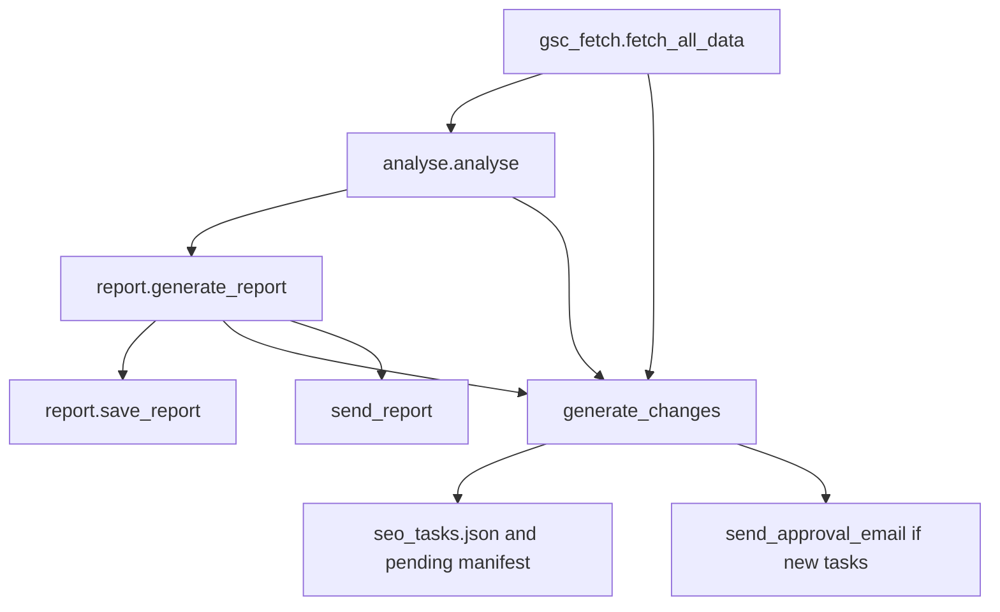

# Weekly SEO pipeline reference

This document describes the **exact function flow**, **data inputs**, **prompts**, and **outputs** for the weekly SEO system in this repository. It matches the code as implemented in `src/` and `prompts/`.

---

## Entry point

- **Local:** `python src/run_weekly.py`
- **CI:** `.github/workflows/weekly_report.yml` runs the same script.

### Orchestration order

1. `gsc_fetch.fetch_all_data()` → raw GSC payload
2. `analyse.analyse(raw_data)` → structured `analysis` dict
3. `report.generate_report(analysis)` → Markdown string (Claude)
4. `report.save_report(report_text)` → `reports/YYYY-MM-DD.md` and `reports/latest.md`
5. `generate_changes.generate_changes(analysis, report_text, ...)` → updates `seo_tasks.json`, optional `pending/{date}-changes.json`
6. `email_report.send_report(report_text, summary)` → Resend highlights email
7. If new tasks exist: `email_report.send_approval_email(manifest_path, ...)`

---

## Google Search Console: what is fetched

**File:** `src/gsc_fetch.py`  
**Property:** `SITE_URL = "sc-domain:ahurucandles.co.nz"`  
**Lag:** reporting `end` date is **today (UTC) minus 3 days** (`DATA_LAG_DAYS`).

Each API row includes: `keys`, `clicks`, `impressions`, `ctr`, `position`.

| # | Dimensions | Window | Stored as | Used in |
|---|------------|--------|-----------|---------|
| 1 | `query` | 90d to `end` | `queries_90d` | `analyse`: quick wins, top queries |
| 2 | `page` | 90d | `pages_90d` | CTR opportunities, top pages, summary |
| 3 | `page`, `query` | 90d | `page_query_90d` | Cannibalisation; dominant page for quick-win tasks |
| 4 | `page` | current 7d | `current_7d` | Week-over-week, summary |
| 5 | `page` | previous 7d | `previous_7d` | Week-over-week, summary |
| 6 | `query` | 28d | `queries_28d` | **Persisted in `data/gsc_*.json` only; not passed to `analyse()`** |

The returned object also includes `site_url`, `fetched_at`, and `date_ranges` (all window boundaries).

---

## `analyse()` output (LLM input JSON)

**File:** `src/analyse.py`

The `analysis` dict contains:

| Key | Role |
|-----|------|
| `summary` | Site-wide metrics: 7d vs prior 7d clicks/impressions; 90d totals; ranked page count |
| `ctr_opportunities` | Up to 20 pages: ≥50 impressions, CTR &lt; 3%, position ≤ 20, sorted by impressions |
| `quick_wins` | Up to 20 queries: positions 5–15, ≥20 impressions |
| `week_over_week` | Up to 15 pages with ≥20% impression swing (prior period ≥10 impressions) |
| `cannibalisation` | Up to 10 query clusters with multiple competing pages |
| `top_pages_90d` | Top 10 pages by **clicks** (90d) |
| `top_queries_90d` | Top 20 queries by **clicks** (90d) |
| `date_ranges` | Echo of fetch windows (`90d`, `current_7d`, `previous_7d`, `28d`) |

**Nothing** from `seo_tasks.json`, Shopify, or prior weekly reports is merged into `analysis`.

---

## Report generation (Claude)

**File:** `src/report.py`

| Setting | Value |
|---------|--------|
| Model | `claude-sonnet-4-6` |
| Max tokens | `4096` |
| System prompt | Full contents of `prompts/system_prompt.md` |
| User message | From `build_user_message(analysis)` |

The user message includes:

- A **report date** string: `datetime.now(timezone.utc).strftime("%d %B %Y")` (UTC, not NZ local).
- The full `analysis` object as indented JSON inside a fenced block.
- Instructions to follow the report format, use URLs from the data, and output ready-to-paste meta strings.

The API uses a single user message: `messages=[{"role": "user", "content": user_message}]`.

---

## System prompt (weekly)

**File:** `prompts/system_prompt.md`

Contains: Āhuru business context, site structure, static “known SEO issues”, and a **fixed Markdown section order** (summary, WoW table, urgent actions, quick wins, CTR opportunities, cannibalisation, dropping/rising pages, content recommendation, top tables, notes).

**Note:** The CTR section **template** in the prompt shows a placeholder like `**[Page URL]**`. The automation in `generate_changes._parse_ctr_opportunities` expects URLs in the form `` **`https://...`** `` with backticks so suggested title/description lines can be parsed. If the model outputs a different shape, meta tasks may not be created.

---

## Saving reports

**File:** `src/report.py` → `save_report`

- Writes `reports/{YYYY-MM-DD}.md` using **`datetime.utcnow()`** for the filename date.
- Overwrites `reports/latest.md` with the same body.

---

## Task generation (`generate_changes`)

**File:** `src/generate_changes.py`  
**No second LLM call.**

Inputs: `analysis`, full `report_text`, `page_query_90d`, `report_date`.

1. **Expire** pending tasks past `expires_date` (28 days after creation).
2. **Parse** `## 🟠 CTR Opportunities` for blocks matching the regex (URL in bold backticks, suggested title/description in backticks).
3. **`meta_update`:** walk `ctr_opportunities` by impressions; cap **5** new meta tasks; skip if `meta_update__{handle}` already pending/approved/applied; skip without parsed copy; optional re-surface rules for dismissed tasks.
4. **`content_update`:** from `quick_wins`, map query → dominant page via `page_query_90d`; cap **5**; same active-ID dedupe.
5. **`canonical`:** from cannibalisation; cap **3**.
6. **Write** `seo_tasks.json` and `pending/{report_date}-changes.json` when there are new tasks.

---

## Email

**File:** `src/email_report.py`

- `send_report`: builds a **short HTML teaser** from the Markdown, KPI strip from `summary`, link to the dashboard URL constant.
- `send_approval_email`: sends when a manifest exists and `RESEND_API_KEY` is set.

---

## End-to-end flow (diagram)

---

## Precision summary

| Topic | Behaviour |
|-------|-----------|
| LLM sees | `analysis` JSON + report date line + `system_prompt.md` |
| LLM does not see | `seo_tasks.json`, raw GSC rows, `queries_28d`, live Shopify |
| Report title date in user message | UTC `now` (English date string) |
| Report file date | UTC date at save time |

---

*Generated to align with repository behaviour; update this file when pipeline code changes.*
